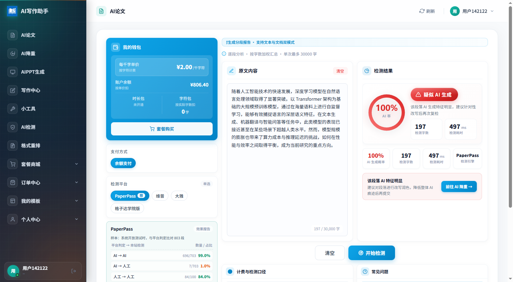
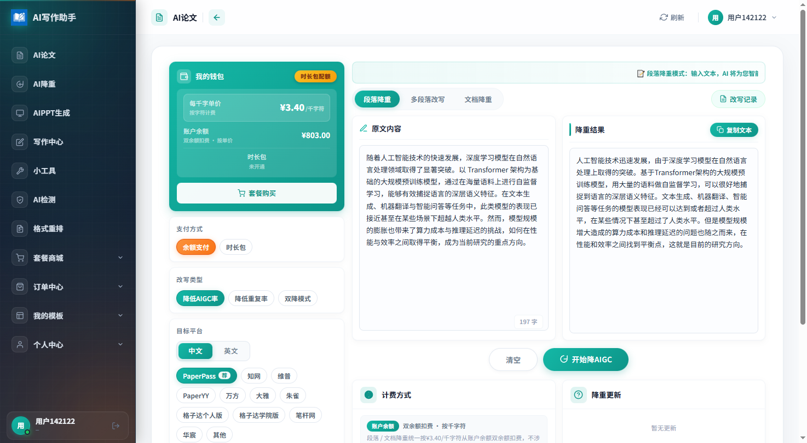
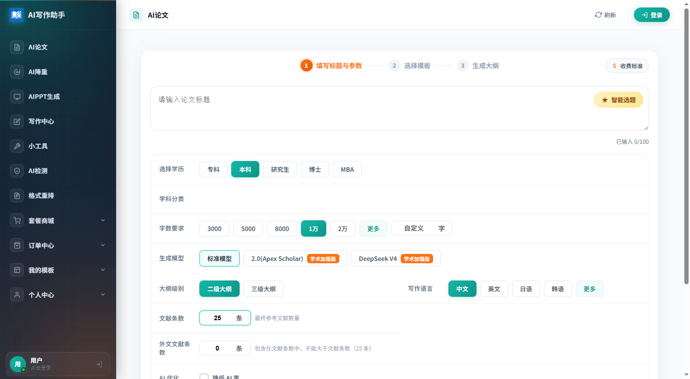
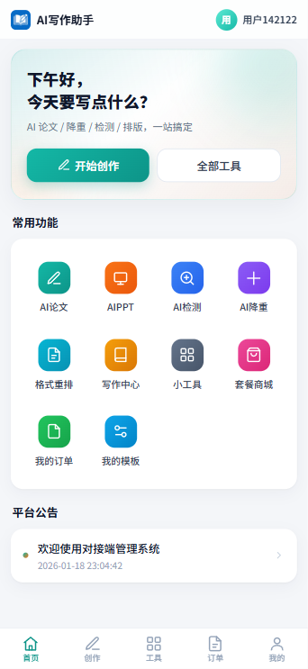

<div align="center">

# AI 论文写作站 · 开源版

**填入上游 API，5 分钟开一个能收钱的 AI 论文站。**

你的域名、你的品牌、你的定价 —— AI 论文、检测、降重全能力对接，工厂价直供，差价全是你的。

👉 **对接凭证获取（API 域名 + Token）**：[www.adhelp.cn](https://www.adhelp.cn)


</div>

---

## 真实效果预览

以下为真实部署环境的实测截图（登录后用真实段落跑检测与降重的结果）：

<div align="center">

**AI 率检测 · 多平台一键实测**



<br/>

**AIGC 降重 · 原文与降重结果对照**



</div>

## 这是什么？

你只需要一台装了宝塔的服务器：

1. 上传源码，安装向导点 3 下
2. 后台填入上游平台的 `api_url` 和 `api_token`
3. 给商品设个加价比例

到此为止，一个拥有**独立会员体系、在线支付、自动计费、订单管理**的 AI 论文站就上线营业了。用户在你站上充值付费，系统按工厂底价向上游结算，**差价实时留在你的账户里**。

不需要养技术团队，不需要对接十几家平台，不需要自己调模型。

<div align="center">

**分步式下单 · AI 论文创建页**



</div>

## 为什么值得部署？

### 1. 工厂价直供，定价权在你手上

- 进价（工厂底价）后台**一键自动拉取**，无需猜成本
- 每个商品单独设加价（按次 / 按千字），随时改价
- 上游预充余额对用户**完全不可见**，成本是你的商业机密

### 2. 全网检测 / 降重平台，一次对接全打通

不用再挨个平台注册、充值、对接文档看断头。一个 API 全覆盖：

| 能力 | 支持平台 |
| --- | --- |
| **AI 率检测** | PaperPass、维普、大雅、格子达（随上游持续扩展） |
| **AI 率降重（中文）** | PaperPass、知网、维普、万方、大雅、朱雀、PaperYY、格子达个人版 / 学院版、笔杆网、华宸 |
| **AI 率降重（英文）** | Turnitin、ZeroGPT、知网、维普、格子达 |
| **重复率降重** | PaperPass、PaperYY 等 |

降AI效果经开放测试与平台官方判定比对：

| 平台 | 比对样本 | 降后与人工判定一致率 |
| --- | --- | --- |
| PaperPass | 803 段 | **97.14%** |
| 大雅 | 746 段 | **94.91%** |
| 格子达 | 991 段 | **94.05%** |
| 维普 | 42,159 句 | **89.68%** |

> 数据为系统开放测试期间与平台判定比对的统计结果，仅供参考；上游平台另有效果保障与退款机制，可结合你的站点政策用于终端营销。

### 3. 开箱即"营业"，赚钱闭环全内置

收钱这件事，系统已经替你想好了：

- **支付**：微信支付 / 支付宝官方商户直连 + 易支付聚合，回调自动处理
- **计费**：按次 / 按字数 / 后付费（下载时扣费）多种模式，流水笔笔可查
- **营销**：充值赠送规则（比例 / 固定金额）、套餐资源包（降重包、检测包）
- **会员**：账号密码 + 邮箱验证码 + 微信扫码登录，一个后台全管理

### 4. PC + H5 双端，装完即用

- 前端为**已构建好的纯静态产物**，上传即生效，服务器不需要 Node 环境
- PC 端 / H5 移动端按浏览器 UA **自动互相分流**，手机访问无感跳转
- 前端完整源码同步开源（Nuxt 3 + Element Plus），想改界面随时可改

<div align="center">

**H5 移动端 · 底部 Tab 导航**



</div>

## 快速开始

1. 将本包**全部文件**上传到网站根目录（宝塔站点目录），运行目录设置为 `public`
2. 创建一个 MySQL 数据库（空库即可）
3. 浏览器访问 `http://你的域名/install.php`，按向导完成安装（环境检测 → 填数据库 → 开始安装）
4. 登录后台 `https://你的域名/admin`：
   - 账号 `admin` / 密码 `admin123456` —— **首次登录后立即改密**
5. 后台 →「对接配置」，填入上游平台的 `api_url` 与 `api_token`，看到上游余额即对接成功
   - 对接凭证请到主站 **[www.adhelp.cn](https://www.adhelp.cn)** 注册账号并开通对接后获取

> 详细步骤见 [docs/部署文档.md](docs/部署文档.md)，后台与用户端功能见 [docs/使用文档.md](docs/使用文档.md)。

**环境要求**：PHP 8.0.x（含 fileinfo 扩展）、MySQL 5.7+、Nginx / Apache。无需 Redis，无需 Composer，无需 Node。

## 目录结构

```
├── app/                  # 后端应用（admin 管理后台 / api 用户端接口 / pay 支付回调等）
├── config/               # 配置（docking.php 对接配置、version.php 版本配置等）
├── public/               # 网站运行目录
│   ├── index.php         # ThinkPHP 入口（用户端 API + admin 后台）
│   ├── pay.php           # 支付回调入口
│   ├── install.php       # 首次安装向导（安装完成后建议删除）
│   ├── pc/               # 用户端 PC 前端（Nuxt 3 已构建静态产物）
│   ├── m/                # 用户端 H5 移动端（Nuxt 3 已构建静态产物）
│   └── static/           # 管理后台静态资源（layui 等）
├── data/
│   └── adlw.sql          # 初始安装 SQL（全表结构 + 最小种子数据）
├── docs/                 # 部署文档 / 使用文档
├── frontend/             # 用户端前端完整源码（Nuxt 3，PC 与 H5 共用一套，可选）
├── vendor/               # Composer 依赖（已内置，无需再 composer install）
├── .env.example          # 环境变量示例（安装向导会自动生成 .env）
└── think                 # ThinkPHP 命令行入口
```

## 前端二次开发（可选）

仅需修改前端时：

```bash
cd frontend
npm install        # 首次
npm run build      # 构建并自动部署到 ../public/pc 与 ../public/m
```

构建产物为纯静态文件（SPA），部署到任意静态目录即可。可选环境变量（写入 `frontend/.env`）：
`NUXT_DOWNLOAD_GATEWAY=https://你的下载网关/download.php`（资源下载加速网关，留空则直接使用上游返回的资源地址）。

## 计费模型

- 用户价 = **进价（上游工厂底价）+ 商品加价**，在后台「商品管理」为每个商品设置加价
- 用户余额为本站独立余额；部分业务（如 PPT、格式重排）为**后付费**模式：下单不扣费，下载时扣费
- 充值支持赠送规则（按比例 / 按固定金额）、支付渠道：余额支付、微信支付、支付宝、易支付

## 安全须知

- **默认管理员密码为 `admin123456`，部署完成后必须立即修改**
- `authcode`（站点安全码）由安装向导自动生成随机值，参与用户登录令牌加盐，请勿手动改为弱值或清空
- 上游 `api_token` 请勿泄露；本项目与上游的全部交互仅通过 openapi 通道
- 建议全站启用 HTTPS；生产环境将 `.env` 中 `APP_DEBUG` 设为 `false`
- 安装完成后建议删除 `public/install.php`（向导自带 install.block 安装锁，此为双保险）

## License

本项目仅供学习与二次开发使用，请遵守所在地区法律法规，勿用于违法违规用途。
使用本系统对接的第三方 AI 服务所产生的费用与合规责任由部署者自行承担。
